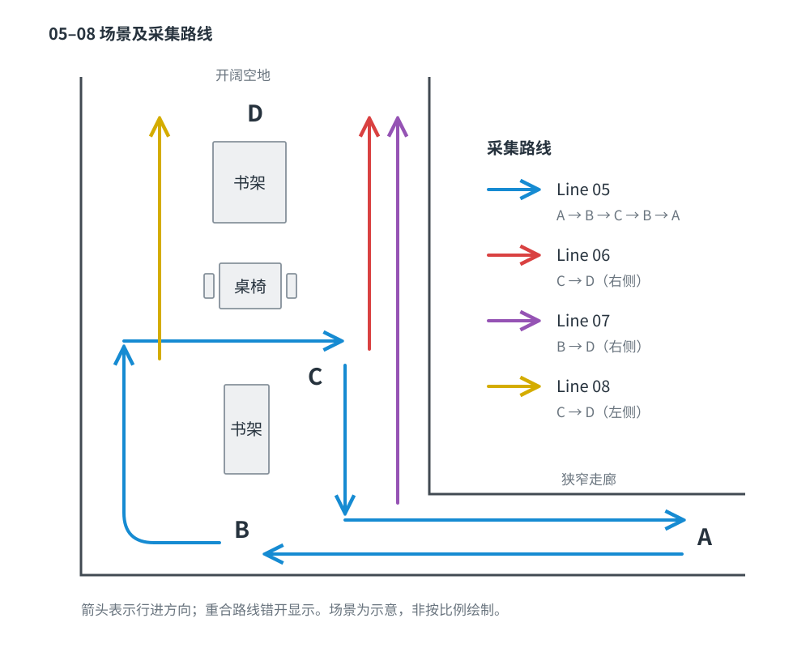

# 数据说明

01-02-03-04场景说明：L型路线 假设拐角为B点，其他两个起点分别为A与C

- 01：40s 由A走向B

- 02：36s 由A走向B 路线、镜头运动与01基本相同

- 03: 23s 由C走向B 第20s-23s区域与01、02的最后一秒拍摄区域重叠 

- 04: 30s 由B走向A 第0s-1s区域与01、02的最后一秒拍摄区域重叠 与03的第20s-23s区域重叠

  

05-06-07-08拍摄为同一组场景 与01-02-03-04的场景不同 05-06-07-08场景说明：A点为狭窄走廊 B点开始为开阔空地 空地被中间的书架与桌椅分割为左右两部分，从B点出发行走空地一半的长度到达C点，再向前走一半到达D点 A直走到B点后需要向右旋转90°才是C点和D点

- 05:64s 从点A出发向前走 在B点向右旋转90°，继续向前走到C点，在C点绕过路中间的书柜旋转180°走到B点，向左转90°，直走回到A点
- 06:30s 从目标区域右侧走过(镜头朝左) C点到D点 但视频最后2s有人员走过
- 07:38s 与06同路线 摄像头运动基本相同 B点到D点
- 08:24s 与06同区域，但从左侧走过（镜头朝右），两视频所拍摄区域相同 C点到D点

# 工作区说明

在一台公共服务器上 可以更改的区域只有/home/user24302666/3dgs/ABot-Recon 大文件存放在/data/user24302666下 新建文件夹  已有conda环境abot 不可以用sudo 不可以rm -rf 能正常访问cuda 测试数据在/home/user24302666/3dgs/ABot-Recon/examples/video_test下 命名为01-08

